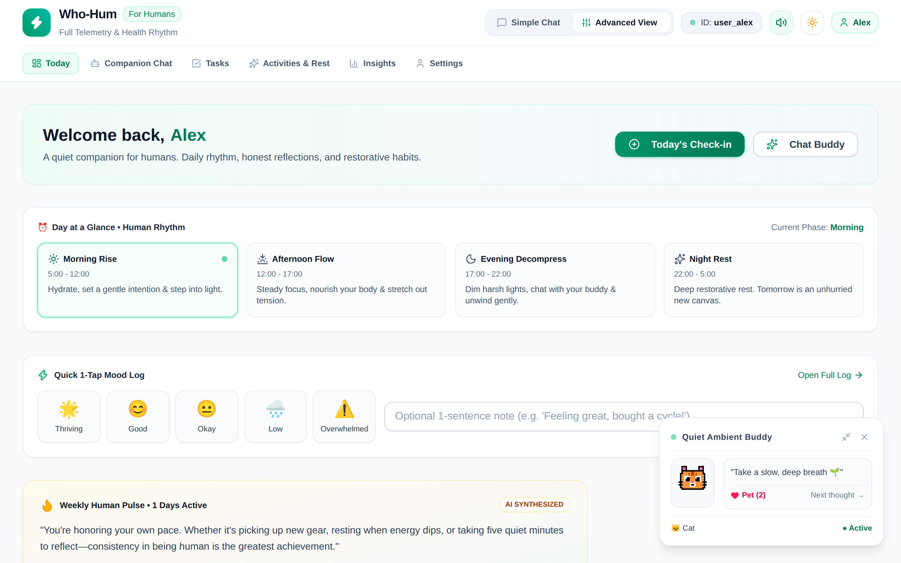
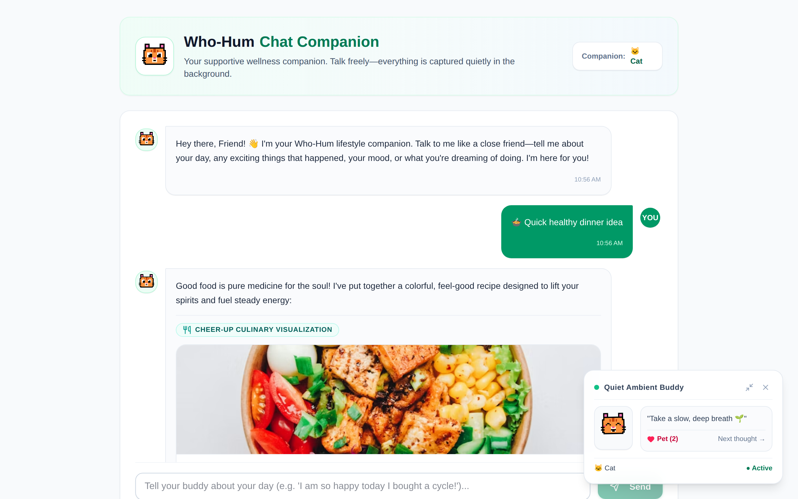
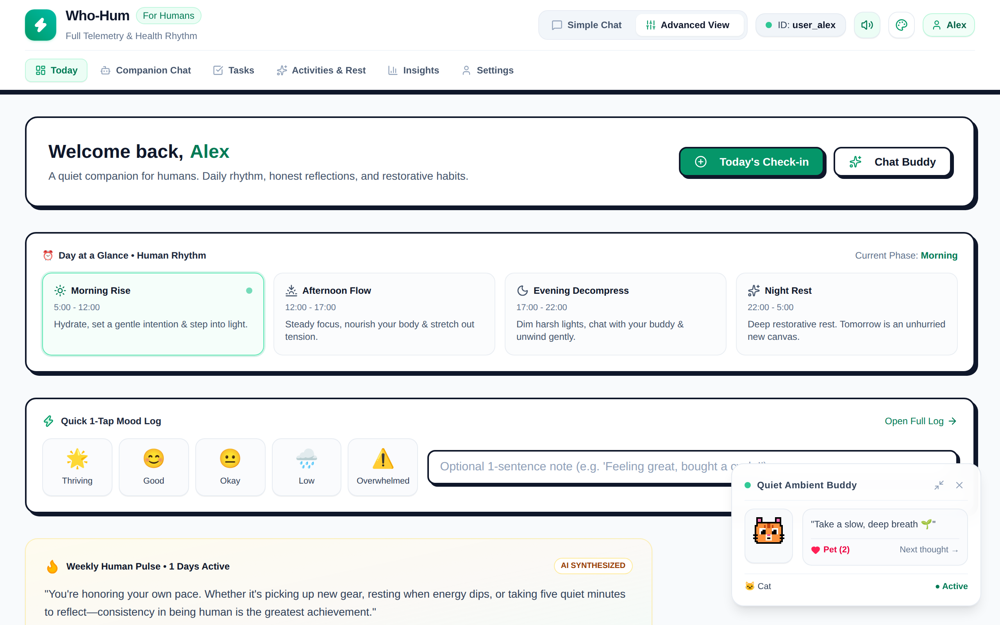
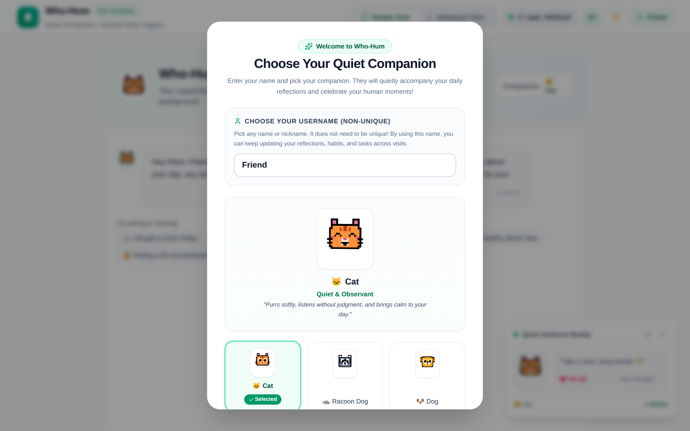
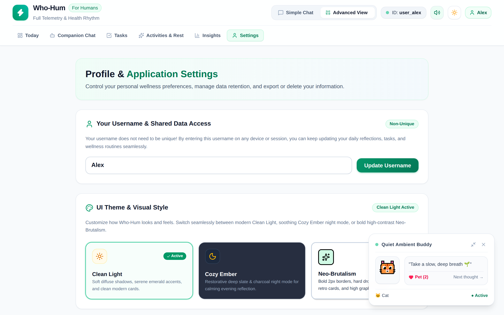

# Who-Hum Wellness Companion

An empathetic, supportive AI companion and habit management agent for personal wellness, fitness milestones, restorative activities, healthy recipes, and mindful life adventures. Built on Google's **Agent Development Kit (ADK)** and powered by **Gemini 3.6 Flash** on **Vertex AI**.


---

## 🌐 Live Web Deployment

Experience the live web application:
- **Primary Live URL**: [https://qwiklabs-gcp-03-478f309b432f.web.app](https://qwiklabs-gcp-03-478f309b432f.web.app)
- **Alternative Mirror**: [https://qwiklabs-gcp-03-478f309b432f.firebaseapp.com](https://qwiklabs-gcp-03-478f309b432f.firebaseapp.com)

**Live Features to Try**:
- 🏷️ **Non-Unique Username Onboarding**: Enter any display name (e.g. `Alex`, `Sam`, `Maya`) on first launch to instantly link and persist your reflections, habits, and tasks across sessions and devices without passwords.
- 🎨 **Tri-Theme Switcher**: Switch seamlessly between **Clean Light**, **Cozy Ember** (restorative night mode), and **Neo-Brutalism** (bold 2px solid borders and hard offset drop shadows).
- 🐱 **Interactive Ambient Buddy**: A floating desktop companion with animated pixel art, thought bubbles, petting counter, and 8-bit synthesized audio feedback.

*(To deploy this application to your own personal Firebase / GCP account, see the [Personal Project Deployment Guide](PERSONAL_PROJECT_DEPLOYMENT_GUIDE.md)).*

---

## 📸 Application Screenshots

Captured directly from the live web deployment at [qwiklabs-gcp-03-478f309b432f.web.app](https://qwiklabs-gcp-03-478f309b432f.web.app):

### Today Dashboard & Companion Chat
| **Today Dashboard & Human Rhythm Tracking** | **Companion Chat & Culinary Recipe Visualization** |
| :---: | :---: |
|  |  |

### Visual Themes & Design Engine
| **Neo-Brutalism Retro High-Contrast Theme** | **Cozy Ember Restorative Night Mode** |
| :---: | :---: |
|  |  |

### Onboarding & Settings
| **Non-Unique Username & Companion Selection** | **Custom Theme Engine & Audio Controls** |
| :---: | :---: |
|  |  |

---

## 🌟 What the Agent Does

The Who-Hum Wellness Companion pairs conversational companionship with structured action cards and multimedia generation to guide users through daily wellness routines, celebrate physical accomplishments, and recommend rejuvenating meals and activities.

### Real Implemented Capabilities & Tools

Based on the codebase in `demo-agent/app/agent.py` and `agents-cli-manifest.yaml`, the agent provides the following active tools:

1. **Cross-Session Long-Term Memory (Vertex AI Memory Bank)**
   - **`PreloadMemoryTool()`**: Automatically queries Vertex AI Memory Bank at the start of every conversation turn to recall past user habits, goals, milestones, and preferences across sessions.
   - **`generate_memories_callback`**: Executes at the conclusion of each interaction turn (`after_agent_callback`) to asynchronously extract key facts and log them to the managed Vertex AI Memory Bank.

2. **Cinematic Short Video Generation (`generate_wellness_video`)**
   - Uses Google's Omni model (**`gemini-omni-flash-preview`** in the `global` Vertex AI region) to generate short, peaceful 720p 16:9 MP4 videos for domain relaxation scenes (e.g., zen rock gardens, ocean sunsets, calming tea ceremonies).
   - Saves the video directly to the ADK session context via `tool_context.save_artifact` so it appears in the developer playground's **Artifacts** panel.
   - Streams and uploads the video bytes directly to **Google Cloud Storage (GCS)**, returning a public HTTPS URL.

3. **Culinary Recipe & High-Resolution Image Pairing (`generate_healthy_recipe_image`)**
   - Recommends mood-boosting, nutritionally balanced meal recipes based on the user's current energy levels.
   - Pairs each dish with high-resolution, curated food photography and detailed preparation notes.

4. **Restorative Exploration & Scenic Navigation (`search_travel_places`)**
   - Discovers tranquil nature walks, cultural sanctuaries, botanic gardens, and scenic points.
   - Provides verified search queries with instant Google Maps navigation links.

5. **A2UI 0.8 Rich Display Surface Protocol**
   - Translates model output into structured **A2UI v0.8** components (`Card`, `Column`, `Row`, `Text`, and `Image`) via `a2ui_callback`.
   - Adapts typography hints (`h1`, `body`) and layout hierarchy to render clean visual cards in the ADK Dev UI and A2A-compliant frontends without raw JSON leaks.

6. **Utility Tools**
   - **`get_weather`**: Location-based weather lookups.
   - **`get_current_time`**: Timezone-aware clock checks.

7. **Client-Side Data Persistence (Cloud Firestore)**
   - The companion web application (`wellness-app`) integrates directly with **Cloud Firestore** for user-scoped check-in histories, energy-aware task management, and hobby trackers under `/users/{userId}/*`.

8. **Non-Unique Username Onboarding & Multi-Device Sync**
   - Users choose any display name or nickname (e.g. `Alex`, `Sam`, `Maya`) on first launch without passwords or complex auth barriers.
   - Derives a deterministic user profile key while preserving user-facing identity across visits and devices, enabling effortless return visits and data continuity.

9. **Tri-Theme Visual Design Engine (Clean Light, Cozy Ember, Neo-Brutalism)**
   - Seamlessly switch themes at any time from the navbar quick toggle or the Settings screen:
     - **Clean Light**: Calming emerald accents, airy whitespace, and soft diffuse shadows (`0 4px 14px -2px rgba(0,0,0,0.04)`).
     - **Cozy Ember**: Restorative warm amber and deep charcoal dark mode (`#090d16` / `#111827`) optimized for late-night reflection without harsh blue light.
     - **Neo-Brutalism**: Retro high-contrast visual style with bold 2px solid black borders, hard unblurred drop-shadows (`4px 4px 0px #0f172a`), chunky input fields, and tactile pressed-button physics.

10. **Interactive Ambient Companion & 8-Bit Web Audio Synthesizer**
    - **Floating Companion Widget ("Tamagotchi Mode")**: Interactive desktop companion widget featuring 6 animated pixel pets (Cat, Racoon Dog, Dog, T-Rex, Cloud Potato, Cloud Blueberry), dynamic thought bubbles, and a persistent petting counter.
    - **Web Audio Synthesizer**: Custom synthesized audio feedback (companion boops, message chimes, celebration fanfares) built directly on the browser's native Web Audio API with zero external media files and one-click mute controls.

---

## 📋 Roadmap & Planned Features

The following capabilities were explored during architectural planning and are scheduled for upcoming milestones:

- **Mobile Application Client (Planned, not yet implemented)**: Native mobile app targeting Kotlin Multiplatform (KMP) / React Native with local offline inference and 4x-daily proactive wellness check-in notifications.

---

## 🏗️ Google Cloud Services & Architecture

| Component | Technology | Configuration / Location |
| :--- | :--- | :--- |
| **Agent Framework** | Google Agent Development Kit (ADK) | `agents-cli` v1.4.0 (`base_template: adk`) |
| **Foundation Model** | Vertex AI Gemini 3.6 Flash (`gemini-3.6-flash`) | Location: `global` |
| **Video Generation** | Vertex AI Omni (`gemini-omni-flash-preview`) | Location: `global` (720p, 16:9 MP4) |
| **Long-Term Memory** | Vertex AI Memory Bank | Agent Platform Memory Service |
| **Media Hosting** | Google Cloud Storage (GCS) | Public Bucket Storage |
| **App Database** | Google Cloud Firestore | Native Mode (`us-central1`) |
| **UI Protocol** | A2UI v0.8 & A2A Protocol | JSON Surface Updates |

---

## 🚀 Local Setup & Run Instructions

### Prerequisites

- **Python 3.11+** with [`uv`](https://docs.astral.sh/uv/) installed.
- **Node.js 18+** and `npm` (for the companion web UI).
- **Google Cloud SDK (`gcloud`)** authenticated with an active project:
  ```bash
  gcloud auth login
  gcloud auth application-default login
  gcloud config set project <YOUR_PROJECT_ID>
  ```

### 1. Running the Agent Backend

Navigate to the agent directory and install dependencies:

```bash
cd demo-agent
uv tool install google-agents-cli
agents-cli install
```

Launch the agent with the local ADK developer playground:

```bash
uv run adk web . --port 8080 --reload_agents
```

To run with persistent Vertex AI Memory Bank integration, provide your Memory Bank service URI:

```bash
uv run adk web . --port 8080 --reload_agents --memory_service_uri=agentengine://<YOUR_MEMORY_BANK_ID>
```

### 2. Running the Companion Web UI

In a separate terminal, install and launch the frontend client:

```bash
cd wellness-app
npm install
npm run dev
```

### 3. Deploying to Google Cloud Agent Engine

To deploy the agent directly to Google Cloud Agent Runtime:

```bash
cd demo-agent
agents-cli deploy
```

---

## 🧪 Testing

### 1. Agent Backend (pytest)

Run the backend agent and tool integration tests:

```bash
cd demo-agent
uv run pytest tests/unit tests/integration
```

### 2. Companion Web App (Vitest)

Run the client-side test suite (33 automated unit and integration tests verifying username onboarding, companion domain logic, 8-bit audio synthesis, ambient buddy, and multi-theme styling):

```bash
cd wellness-app
npm test
```

---

## 🔒 Safety & Privacy

The Who-Hum Wellness Companion is designed as a personal habit and lifestyle support tool. It maintains strict ethical boundaries:
- It does **not** provide clinical diagnosis, psychiatric therapy, or medical treatment plans.
- Conversations are treated with privacy and isolated per user ID in Firestore.
